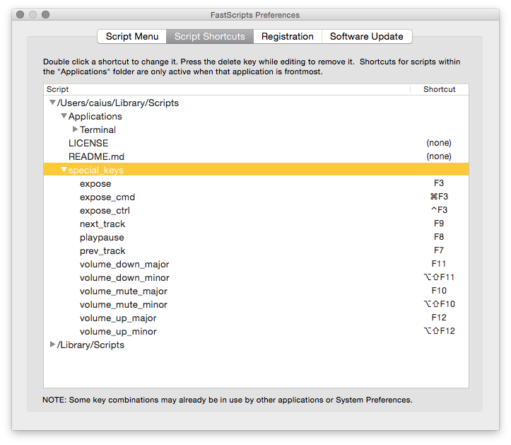

# Special Key Scripts

Scripts that I bind to function keys on my external keyboard to mimic the internal apple keyboard's media keys. (I use [FastScripts](http://www.red-sweater.com/fastscripts/) to bind them, works fairly well.)

## Scripts

I'm trying to replicate the behaviour of the builtin media keys as closely as possible, down to modifier key behaviours.

* F3 - `expose.scpt` - Expose key (Mission Control)
* Cmd-F3 - `expose_cmd.scpt` - Cmd-Expose key (Show Desktop)
* Ctrl-F3 - `expose_ctrl.scpt` - Ctrl-Expose key (Show application windows)
* F7 - `prev_track` - skips iTunes/Spotify to the previous track
* F8 - `playpause` - toggles play/pause in iTunes/Spotify
* F9 - `next_track` - skips iTunes/Spotify to the next track
* F10 - `volume_mute_major` - Toggles volume mute
* Shift-Alt-F18 - `volume_mute_minor` - Toggles volume mute (identical to `volume_mute_major` in fact)
* F11 - `volume_down_major` - Decrements volume by one bar
* Shift-Alt-F11 - `volume_down_minor` - Decrements volume by one fourth of a bar
* F12 - `volume_up_major` - Increments volume by one bar
* Shift-Alt-F12 - `volume_up_minor` - Increments volume by one fourth of a bar

Here's a screenshot of my fastscripts preferences so you can see the mappings:

## License

See LICENSE.
